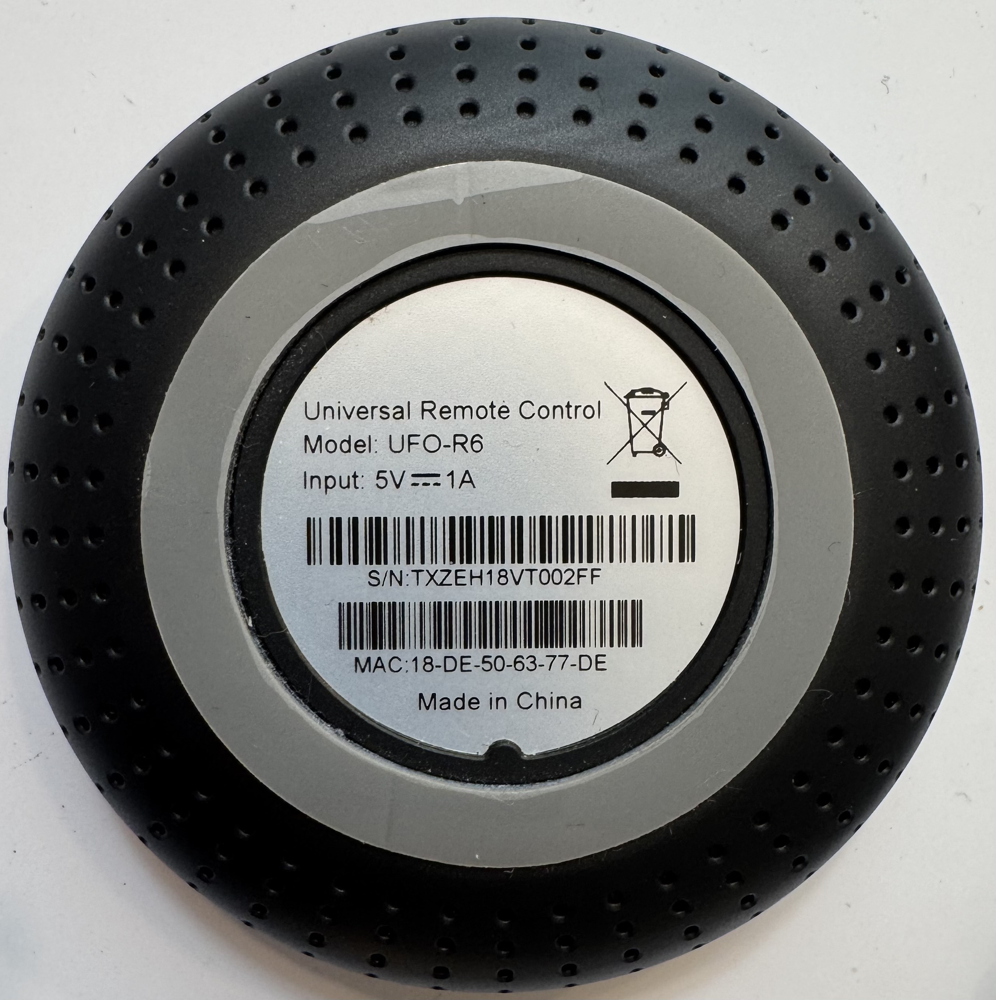
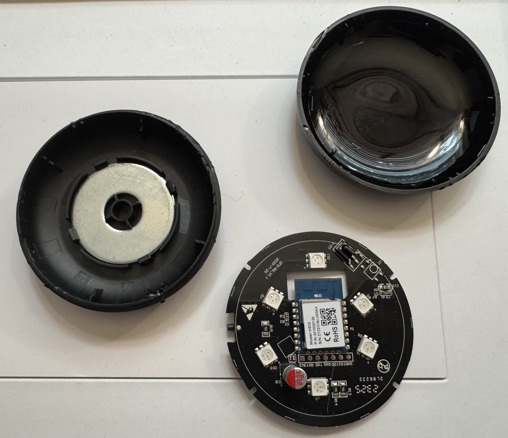
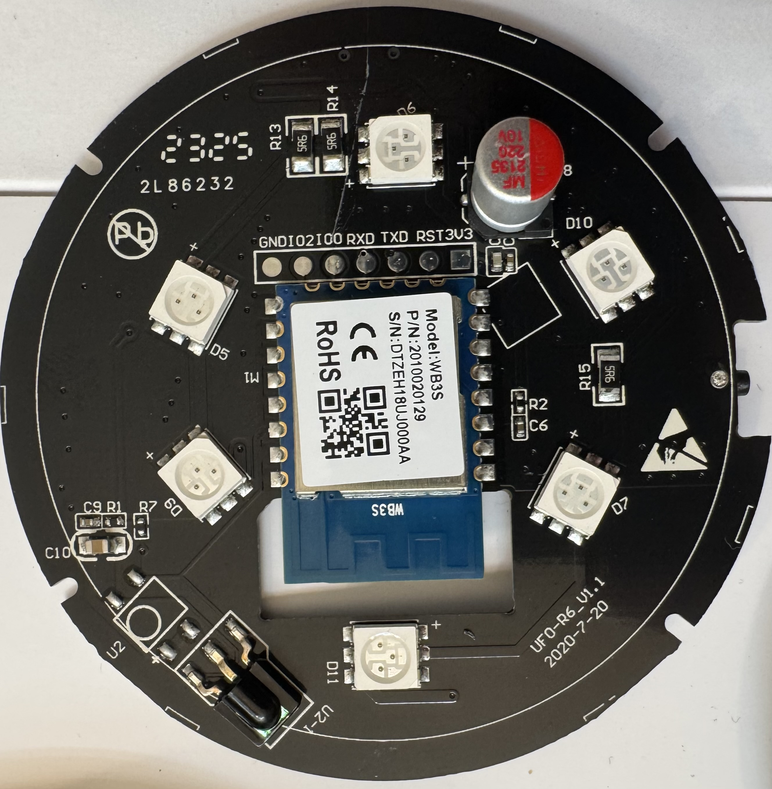
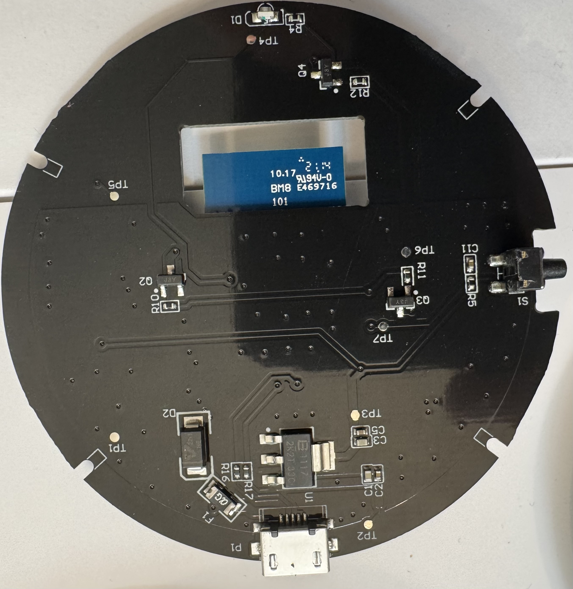
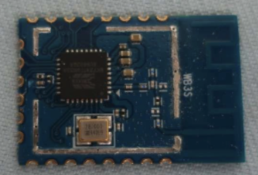
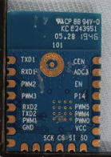

# UFO-R6 Smart Remote IR Controller Teardown

Teardown and research notes for the UFO-R6, a small Wi-Fi infrared blaster sold
under MOES, MoesGo, Jinvocloud, Tuya Cloud Smart, and other white-label names.

This sample is a 5 V micro-USB powered Tuya-platform IR controller. The main
module is a Tuya WB3S Wi-Fi/BLE module. The board has six large SMD IR emitters,
an IR learning receiver, a reset/config button, and simple transistor driver
stages. It is IR-only. It is not an RF, Zigbee, Z-Wave, or Bluetooth remote
bridge.



## Device Identity

Observed on this physical sample:

| Field | Value |
| --- | --- |
| Label name | Universal Remote Control |
| Model | UFO-R6 |
| Power input | 5 V DC, 1 A |
| Country of origin | Made in China |
| Wireless MAC OUI | `18:DE:50`, a Tuya Smart Inc. prefix |
| Internal Wi-Fi module | Tuya WB3S |
| PCB marking | `UFO-R6-V1.1`, `2020-7-20` |

Public sources disagree on branding and manufacturer. MOES lists the product as
`UFO-R6-MS`. Amazon lists brand `Jinvocloud`, model `UFO-R6`, seller `Tuya Cloud
Smart`, and manufacturer `Shenzhen Tuya Cloud Technology Co.,Ltd`. The EU
declaration PDF names Wenzhou Morning Electronics Co., LTD. Some manual versions
use MOES/MoesGo and Wenzhou/Yueqing Nova text. Treat this as a Tuya/OEM
white-label product rather than a single clean brand identity.

## Claimed Specifications

The MOES compliance page, MOESHouse product page, and manual family agree on the
core specs:

| Item | Claim |
| --- | --- |
| Power input | 5 V / 1 A |
| Standby power | <= 0.4 W |
| IR carrier | 38 kHz |
| IR control distance | <= 8 m, environment dependent |
| Wireless | Wi-Fi 802.11 b/g/n, 2.4 GHz only |
| Frequency band | 2.412 to 2.484 GHz |
| Radio transmit power | < +16 dBm |
| Operating humidity | <= 85% RH, no condensation |
| Operating temperature | -10 deg C to 50 deg C in the MOES compliance page/manual; MOESHouse says 0 deg C to 50 deg C |
| Size | MOESHouse lists 68 x 68 x 19.5 mm |

Amazon also lists a 10 m maximum range and 15 supported devices. The manual FAQ
phrases range as a 16 m diameter, which is consistent with the 8 m claim.

## Mechanical Teardown

The enclosure is a round puck with a black perforated lower shell and a smoked
translucent upper dome. The dome hides the PCB while allowing IR output. The
bottom has a product label and gray annular pad. The shell appears snap-fit; it
can be opened, but pry marks are likely.



Visible mechanical features:

| Feature | Observation |
| --- | --- |
| Top shell | Smoked IR-transparent plastic |
| Bottom shell | Black perforated puck |
| PCB | Round, almost full-diameter board |
| Power connector | Micro-USB, not USB-C |
| User input | Side-accessible reset/config button |
| Battery | None observed |

## PCB Top Side



Top-side observations:

| Part / marking | Likely role |
| --- | --- |
| Tuya `WB3S` module | Main Wi-Fi/BLE module and application MCU |
| Six 5050-style packages around the PCB | IR emitter array |
| Black side-looking component near `U2` | IR learner/receiver |
| `S2` tactile switch area | Reset or pairing input |
| 220 uF / 10 V electrolytic capacitor | Bulk decoupling for pulse loads |
| Pads labeled `GND IO2 IO0 RXD TXD RST 3V3` | Factory/programming/debug access |
| Empty module footprint | Alternate module or production option |

The WB3S antenna sits over a rectangular PCB keepout. That removes copper under
the antenna and is consistent with normal 2.4 GHz module layout guidance.

## PCB Bottom Side



Bottom-side observations:

| Part / marking | Likely role |
| --- | --- |
| `P1` | Micro-USB 5 V input |
| `U1` | Likely 3.3 V regulator or small power IC |
| `F1` / `0` style part | Input link, fuse, or zero-ohm protection element |
| `D2` | Input protection or steering diode |
| SOT-23 devices marked like `J3Y` at `Q2`, `Q3`, `Q4` | Transistor stages for emitters or indicators |
| `D1` | Small status LED |
| `TP1` through `TP7` | Factory test points |
| `S1` | Side button path |

No battery charger, speaker, microphone, camera, relay, RF transmitter, or sensor
module is visible on this sample.

## Architecture

```text
5 V micro-USB input
|
+--> input protection / filtering
|
+--> IR emitter supply path
|    |
|    +--> transistor driver stages
|         |
|         +--> six SMD IR emitters
|
+--> 3.3 V regulator
     |
     +--> Tuya WB3S module
          |
          +--> Wi-Fi / BLE onboarding
          +--> IR transmit GPIOs
          +--> IR learner input
          +--> status LED and reset/config button
```

The WB3S likely generates the control waveform and hands the high-current IR
drive to discrete transistor stages. The board is simple and cost-optimized.

## Firmware And Modding Notes

The observed module is Tuya WB3S. Tuya's module selection page identifies WB3S
as a BK7231T-based Wi-Fi/Bluetooth module. Community firmware work should be
approached as BK7231T work, not ESP8266 work.

The FCC filing for `2ANDL-WB3S` includes module photos that match the WB3S module
style observed in this unit:




Practical notes:

- Use a 3.3 V UART adapter only. Do not connect a 5 V serial adapter.
- The `GND`, `RXD`, `TXD`, `RST`, and `3V3` pads make dumping or reflashing
  plausible, but this teardown did not verify the boot procedure.
- The `IO0` and `IO2` labels look ESP-style. Do not assume ESP8266 boot
  behavior on this WB3S/BK7231T sample.
- For cloud-free firmware, start with LibreTiny/ESPHome `wb3s` support or
  OpenBeken-style BK7231T tooling.
- Back up the full stock flash before changing anything.
- The useful missing data is the GPIO map for IR transmit, IR receive, LED, and
  reset button.

Classic ESP8266 Tasmota templates do not apply directly unless the module is
physically replaced with an ESP-compatible module. Community notes document that
replacement path for this product family, but it was not attempted here.

## IR Behavior

The device is designed around 38 kHz carrier IR. Listings and manuals describe
support for air conditioners, TVs, set-top boxes, TV boxes, fans, projectors,
DVD players, and similar IR appliances.

Important limits:

- IR is line-of-sight and does not pass through walls.
- It will not control RF, Bluetooth, UHF, Zigbee, Z-Wave, or proprietary 2.4 GHz
  remotes.
- Learning is documented as 38 kHz only. Other carrier frequencies may fail.
- One manual version says the "Copy button" path supports TV/STB/TV box/fan and
  excludes air conditioners.
- Air-conditioner support depends heavily on the cloud code database because AC
  remotes often transmit full state packets rather than simple button events.

The six-emitter layout and smoked dome should provide broad room coverage when
the puck has line of sight to the target device.

## App And Cloud Behavior

The product is marketed for MOES, Smart Life, and Tuya-style apps. The MOES app
download link redirects through `a.smart321.com/moeswz`. Manuals say Tuya Smart
and Smart Life still work, although MOES is recommended.

Typical setup flow:

1. Install MOES or a compatible Tuya/Smart Life app.
2. Register or log in.
3. Hold reset for about 5 seconds until the network indicator blinks.
4. Pair on 2.4 GHz Wi-Fi. The manual also asks for phone Bluetooth to be enabled.
5. Add appliance remotes from the cloud database, or use copy/DIY learning.

Voice assistant support is cloud-mediated through Alexa/Google account linking.
Amazon listing copy also mentions IFTTT support.

The manual FAQ says the IR code library is kept in the cloud and the device must
connect to the internet. Stock firmware should therefore be treated as a
Tuya/MOES cloud device, not a local-first IR bridge.

## Security Notes

I did not see a microphone, camera, speaker, or temperature/humidity sensor on
this sample. The main privacy issue is the cloud IoT stack.

Reasonable deployment posture:

- Put it on an IoT VLAN or guest-style SSID.
- Block lateral access to sensitive LAN devices.
- Allow only required outbound connectivity if keeping stock firmware.
- Prefer cloud-free firmware only after backing up the stock flash and proving
  the GPIO mapping.

## Compliance Notes

The compliance trail is fragmented:

- The label shows WEEE-style disposal marking and 5 V / 1 A input.
- The MOES compliance page links an EU declaration PDF for UFO-R6.
- That PDF lists RED, RoHS, and EMC directives.
- Amazon names Shenzhen Tuya Cloud Technology Co.,Ltd as manufacturer.
- The MOES declaration PDF names Wenzhou Morning Electronics Co., LTD.
- Some manual versions name Wenzhou/Yueqing Nova entities.
- I did not find a separate final-product FCC ID on the physical label. I also
  did not see an integrator-style `Contains FCC ID: 2ANDL-WB3S` statement on the
  outside label. Given the visible WB3S radio module, I would expect either a
  final-product FCC ID or a "Contains FCC ID" module reference somewhere in the
  product labeling or documentation.
- In absence of that final-product label evidence, there is at least an
  apparently matching related FCC modular approval: `FCC ID 2ANDL-WB3S`, a
  Hangzhou Tuya Information Technology Co.,Ltd Wi-Fi and Bluetooth Module filing
  with user manual, internal photos, external photos, label, RF exposure, and
  test-report exhibits.

## Open Questions

- Exact GPIO mapping from WB3S to IR emitters, IR learner, LED, and button.
- Whether the six IR emitters are driven as one bank or multiple banks.
- Actual standby power and transmit pulse current.
- Actual IR wavelength and carrier quality.
- Whether stock firmware exposes a useful LAN-local control path.
- Purpose of the empty module footprint.

## Source Links

- [Amazon listing: WiFi IR Blaster, model UFO-R6](https://www.amazon.com/Automation-Infrared-Universal-Compatible-Assistant/dp/B0DLZNJZCG)
- [MOESHouse product page: WiFi Infrared Remote Control, SKU UFO-R6-MS](https://moeshouse.com/products/wifi-ir-infrared-control)
- [MOES compliance/specification page for UFO-R6](https://www.moestech.com/blogs/news/ufo-r6)
- [MOES EU declaration PDF](https://cdn.shopify.com/s/files/1/0531/3206/6981/files/UFO-R6.pdf?v=1715913137)
- [Manuals+ user guide for MoesGo UFO-R6](https://manuals.plus/moesgo/ufo-r6-wifi-smart-remote-ir-controller-manual)
- [Amazon quick setup PDF](https://m.media-amazon.com/images/I/81R5HTP83AL.pdf)
- [Amazon voice assistant setup PDF](https://m.media-amazon.com/images/I/91dD6DWaSLL.pdf)
- [MOES app redirect page](https://a.smart321.com/moeswz)
- [FCC ID 2ANDL-WB3S: Tuya WB3S Wi-Fi and Bluetooth Module](https://fccid.io/2ANDLWB3S)
- [FCC WB3S user manual exhibit](https://fccid.io/2ANDL-WB3S/User-Manual/User-manual-4580793)
- [FCC WB3S internal photos exhibit](https://fccid.io/2ANDL-WB3S/Internal-Photos/Internal-photos-4580783)
- [FCC WB3S external photos exhibit](https://fccid.io/2ANDL-WB3S/External-Photos/External-photos-4580780)
- [FCC WB3S label exhibit](https://fccid.io/2ANDL-WB3S/Label/Label-4580781)
- [Tuya Developer module selection, including WB3S](https://developer.tuya.com/en/docs/iot/product-hardware-module-selection?id=K9tp14pwa3pxw)
- [LibreTiny WB3S board notes](https://docs.libretiny.eu/boards/wb3s/)
- [Blakadder MOES UFO-R6 community template/replacement note](https://templates.blakadder.com/moes_UFO-R6.html)
- [MAC lookup for OUI 18:DE:50](https://maclookup.app/macaddress/18de50)

## Photo Index

- [01-bottom-label.jpg](assets/photos/01-bottom-label.jpg) - label, model, power input, serial/MAC labels.
- [02-open-housing-and-pcb.jpg](assets/photos/02-open-housing-and-pcb.jpg) - opened shell, smoked dome, PCB placement.
- [03-pcb-top-wb3s-ir-emitters.jpg](assets/photos/03-pcb-top-wb3s-ir-emitters.jpg) - WB3S module, emitter ring, learner, pads.
- [04-pcb-bottom-power-drivers.jpg](assets/photos/04-pcb-bottom-power-drivers.jpg) - USB input, power area, drivers, test pads.
- [wb3s-fcc-top.png](assets/fcc/wb3s-fcc-top.png) - WB3S top-side reference image from the FCC exhibit set.
- [wb3s-fcc-bottom.png](assets/fcc/wb3s-fcc-bottom.png) - WB3S bottom-side reference image from the FCC exhibit set.
